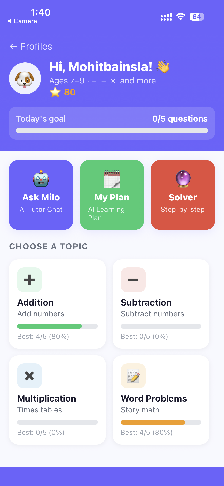
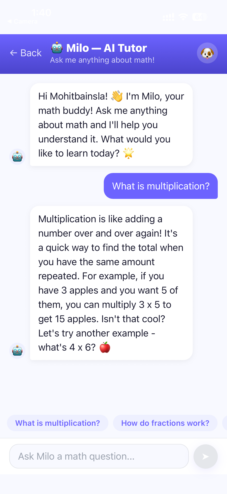
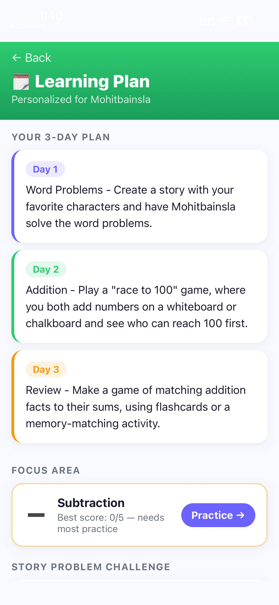
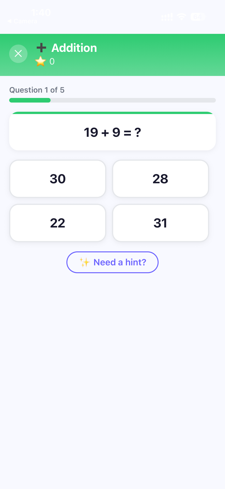
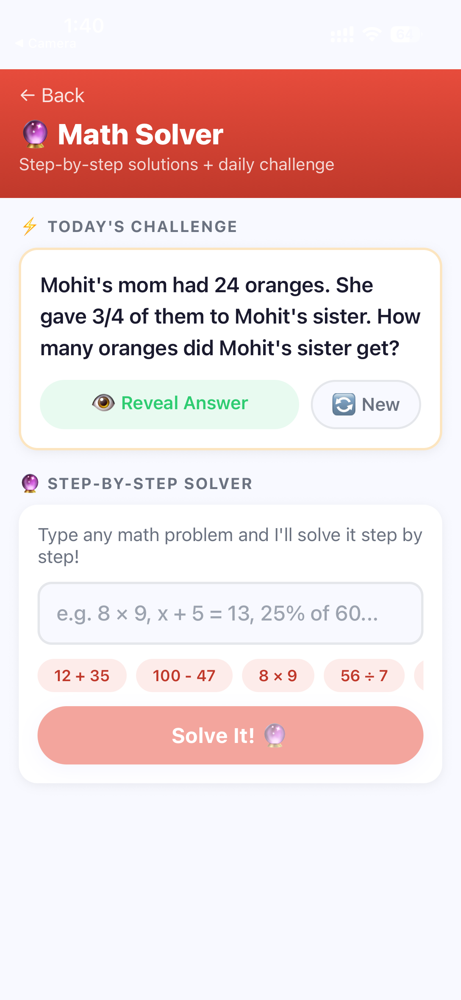

  

# 📱 MathWorld AI  

🚀 AI-powered math learning app that solves problems with step-by-step explanations  

## 💡 Why I Built This

I built MathWorld AI to make learning math easier and more interactive using AI.  
The goal is to help users not just get answers, but actually understand concepts.

---
## 🚀 Download App

  

⚠️ Enable "Install from unknown sources" before installing  

---

## 📸 App Screenshots

  
  
  
  
  
  

  🏠 Home &nbsp;&nbsp;&nbsp;
  👤 Profile &nbsp;&nbsp;&nbsp;
  🤖 AI Tuitor &nbsp;&nbsp;&nbsp;
  📚 Learning Plan &nbsp;&nbsp;&nbsp;
  ❓ Questions &nbsp;&nbsp;&nbsp;
  🧮 Solver

---

## ⚡ Highlights

- 📱 Real working Android app  
- 🤖 AI-powered math assistant  
- 📖 Step-by-step explanations  
- 🚀 Built from scratch

---

## 🧠 Features
- 🧮 Solve math problems instantly  
- 📖 Step-by-step explanations  
- 🤖 AI-powered responses  
- ⚡ Fast & simple UI  

---

## 🛠️ Tech Stack
- Python  
- AI APIs (Claude / OpenAI)  
- Mobile Application (APK)  

---

## ⚡ How it Works
1. Enter a math problem  
2. AI processes the query  
3. Returns solution with explanation  

---

## 🚀 Future Improvements
- Voice input  
- Graph visualization  
- Web version  

---

## 👨‍💻 Author
Mohit Bainsla
